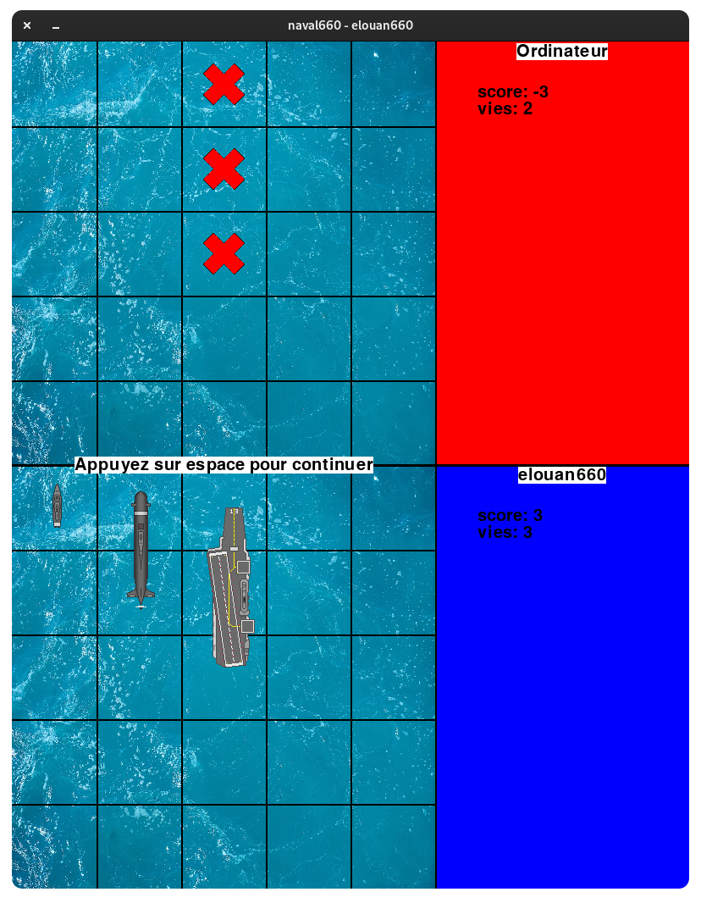

# Naval
Jeu de bataille Navale créé dans le cadre d'un projet de NSI en terminale

## Mode d'emploi
Ce jeu ce jeu seul contre l'ordinateur \
Dans ce jeu votre but est de détruire tout les bateaux adverses. 
Lorsque vous commencez vous devez placer 3 bateaux, vous commencez par placer à l'aide d'un clic de souris sur une case de votre plateau une frégate (taille 1) puis un sous-marin (taille 2) et enfin un porte avion

Entre chaque tour vous devez appuyer sur espace, ceci pour éviter le réflexe facheux du double click

Lorsque vous êtes en mesure d'attaquer, vous devez cliquer sur une case du plateau adverse, les bateaux adverses sont invisibles, attention lorsque vous attaquez l'ordinateur riposte automatiquement

Lorsqu'un navire est touché, toutes les cases qu'il occupait sont remplacées par des croix rouges, le nombre de cases qu'il occupait est soustrait du score de son propriétaire -qui perds par la même occasion une vie- et ajouté au score de l'attaquant. \
Les bélligérants ont trois vies, le premier à perdre toutes ses vies à perdu

Mentions légales:

[Ship icons created by Freepik - Flaticon](https://www.flaticon.com/free-icons/ship)
